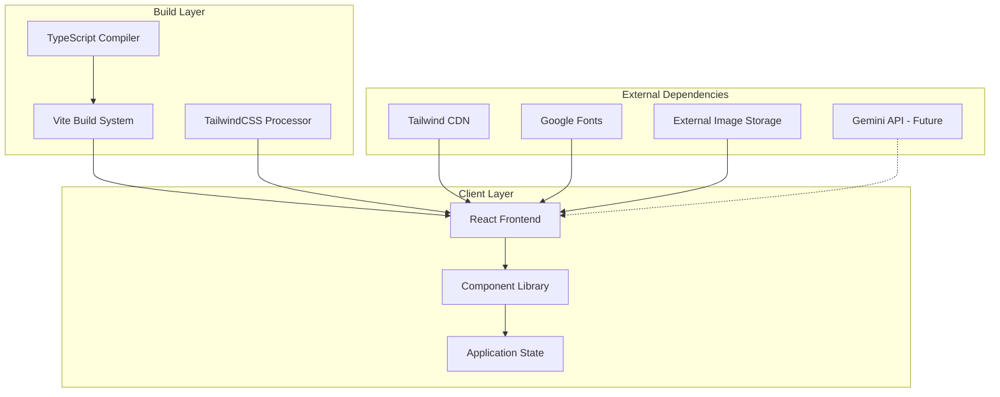
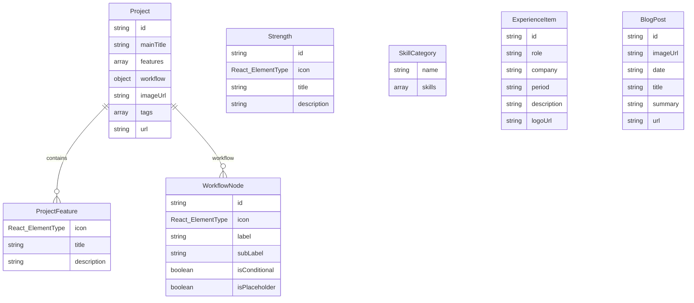
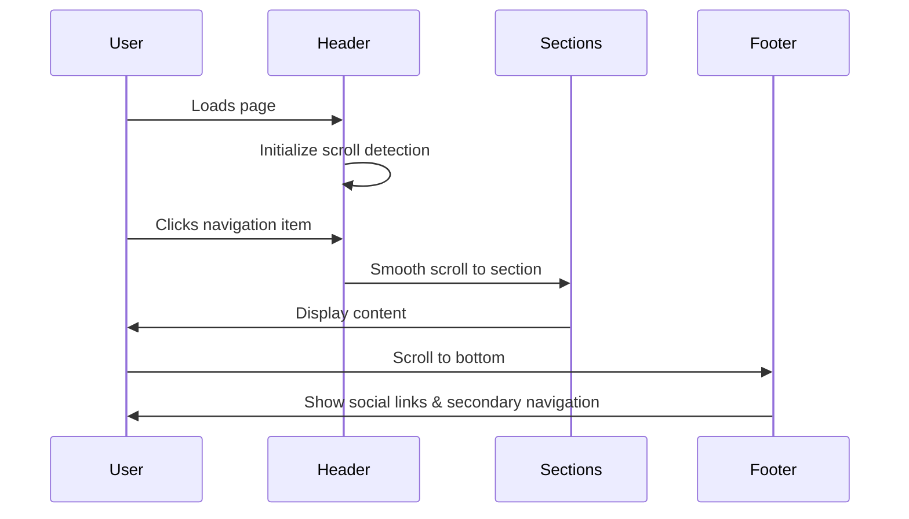
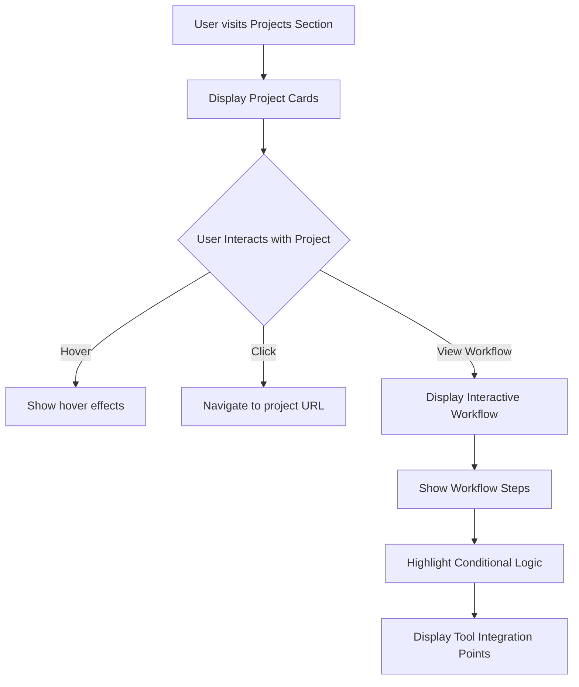
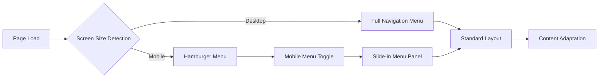
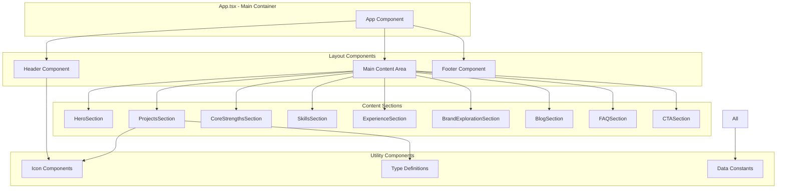
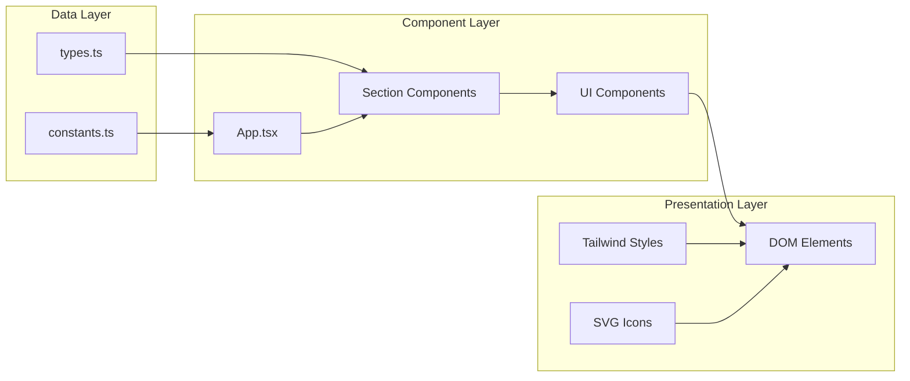
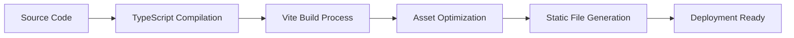

# Architectural Document: Jacob Kazadi Kayembe Portfolio Site

## High-Level Application Overview and Purpose

Jacob Kazadi Kayembe's portfolio website is a modern, AI-focused personal branding platform designed to showcase expertise in AI integration, full-stack marketing, and digital transformation. The application serves as a comprehensive showcase of professional capabilities, featuring:

- **Primary Purpose**: Personal portfolio and professional showcase
- **Target Audience**: Potential clients, collaborators, and employers in AI/marketing domains
- **Core Value Proposition**: Demonstrating expertise in AI-enabled marketing automation and strategic digital solutions
- **Business Goals**: Lead generation, professional networking, and thought leadership establishment

## System Architecture Overview



## Main Components

### Frontend Architecture

The application follows a component-based React architecture with the following main components:

#### Core Components
- **Header**: Navigation with responsive mobile menu, scroll-based styling
- **HeroSection**: Primary landing area with personal branding and tech stack display
- **ProjectsSection**: Interactive project showcase with workflow visualizations
- **CoreStrengthsSection**: Professional capabilities highlight
- **SkillsSection**: Technical and business skills categorization
- **ExperienceSection**: Professional timeline
- **BrandExplorationSection**: AI-generated brand concept gallery
- **BlogSection**: Content marketing showcase
- **FAQSection**: Interactive Q&A
- **CTASection**: Lead generation and contact
- **Footer**: Secondary navigation and social links

#### Specialized Components
- **Icon Library**: Custom SVG icons organized by category
  - `SocialMediaIcons.tsx`: Social platform icons
  - `InterfaceIcons.tsx`: UI interaction icons
  - `TechStackIcons.tsx`: Technology and tool icons

### Backend Architecture

**Current State**: Frontend-only static application
**Future Integration**: Gemini API integration configured for AI-powered features

### Database Architecture

**Current State**: No database - all content stored in constants
**Data Storage**: JSON-like object structures in `constants.ts`

### External Integrations

- **Tailwind CDN**: Styling framework
- **Google Fonts**: Typography (Inter font family)
- **External Image Storage**: Cloud-based image hosting for portfolio content
- **Gemini API**: Configured but not actively used (future AI features)

## Key Data Models

### Core Data Structures



### Data Model Details

#### Project Model
```typescript
interface Project {
  id: string;
  mainTitle: string;
  features: [ProjectFeature, ProjectFeature, ProjectFeature]; // Exactly 3 features
  workflow: {
    line1: WorkflowNode[];
    conditionalNode?: WorkflowNode;
    line2TrueBranch?: WorkflowNode[];
  };
  imageUrl?: string;
  tags?: string[];
  url?: string;
}
```

#### Personal Information Model
```typescript
interface PersonalInfo {
  name: string;
  initials: string;
  tagline: string;
  heroHeadline: {
    part1: string;
    gradient1: string;
    part2: string;
    gradient2: string;
    part3: string;
  };
  profileImageUrl: string;
  contraUrl: string;
}
```

## Core Workflows

### User Navigation Flow



### Project Showcase Workflow



### Responsive Design Workflow



## Tech Stack

### Frontend Technology Stack

| Layer | Technology | Version | Purpose |
|-------|------------|---------|---------|
| **Framework** | React | 19.1.0 | UI component library |
| **Language** | TypeScript | 5.7.2 | Type-safe development |
| **Build Tool** | Vite | 6.2.0 | Fast build and dev server |
| **Styling** | Tailwind CSS | CDN | Utility-first CSS framework |
| **Icons** | Custom SVG Components | - | Scalable icon system |
| **Fonts** | Google Fonts (Inter) | - | Typography system |

### Development Environment

| Tool | Purpose |
|------|---------|
| **Node.js** | JavaScript runtime |
| **npm** | Package management |
| **ESM** | Module system |
| **Hot Reload** | Development experience |

### External Services

| Service | Purpose | Status |
|---------|---------|---------|
| **Tailwind CDN** | CSS Framework | Active |
| **Google Fonts** | Web Typography | Active |
| **Gemini API** | AI Integration | Configured |
| **Cloud Storage** | Image Hosting | Active |

## Component Architecture Diagram



## Data Flow Architecture



## Security Considerations

### Current Security Measures
- **API Key Management**: Environment variable configuration for Gemini API
- **External Link Security**: `rel="noopener noreferrer"` on external links
- **Content Security**: All content statically defined, no user input processing

### Future Security Recommendations
- Implement Content Security Policy (CSP) headers
- Add input validation for future form submissions
- Implement rate limiting for API calls
- Add HTTPS enforcement

## Performance Optimizations

### Current Optimizations
- **Font Preloading**: Google Fonts with preconnect
- **Image Optimization**: External cloud storage with optimized delivery
- **CSS Optimization**: Tailwind CSS utility classes
- **Code Splitting**: Vite automatic code splitting
- **Smooth Scrolling**: CSS smooth scroll behavior

### Future Performance Enhancements
- Implement lazy loading for images
- Add service worker for caching
- Optimize bundle size with tree shaking
- Implement progressive web app features

## Deployment Architecture

### Current Deployment
- **Type**: Static site deployment
- **Build Process**: `vite build` generates optimized static files
- **Hosting**: Static hosting platform compatible

### Build Pipeline


## Future Enhancements

### Planned Features
1. **AI Integration**: Gemini API for dynamic content generation
2. **CMS Integration**: Headless CMS for blog management
3. **Analytics**: User behavior tracking and insights
4. **Contact Forms**: Lead generation functionality
5. **Multi-language Support**: Internationalization
6. **Dark/Light Mode**: Theme switching capability

### Scalability Considerations
- **Component Library**: Extract reusable components for future projects
- **API Layer**: Implement proper API abstraction
- **State Management**: Consider Redux/Zustand for complex state
- **Testing**: Add comprehensive test coverage
- **CI/CD**: Implement automated deployment pipeline

## Conclusion

This portfolio site represents a modern, well-architected React application focused on showcasing AI and marketing expertise. The architecture is designed for maintainability, performance, and future extensibility, with clear separation of concerns and a solid foundation for growth.

The application successfully demonstrates the owner's technical capabilities while serving as an effective marketing tool for professional services in the AI and digital marketing space. 