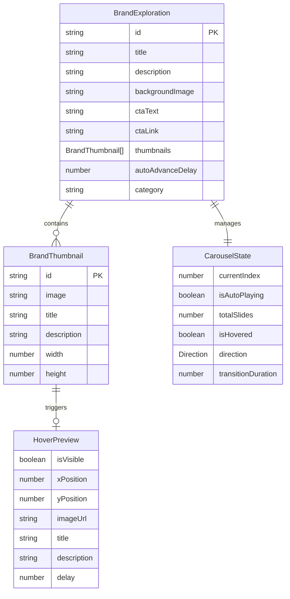
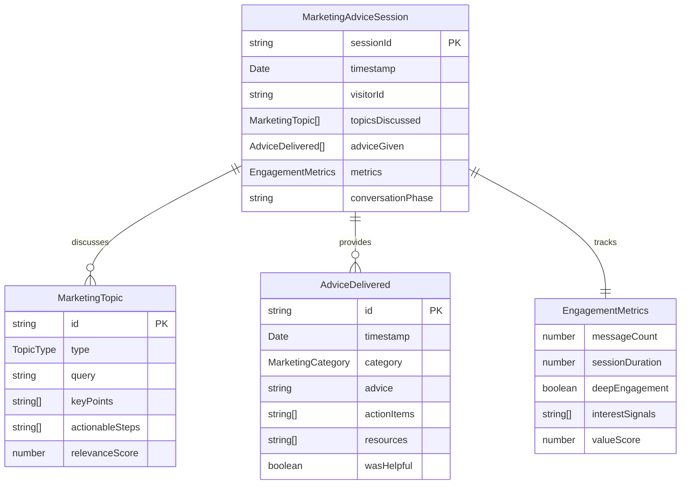
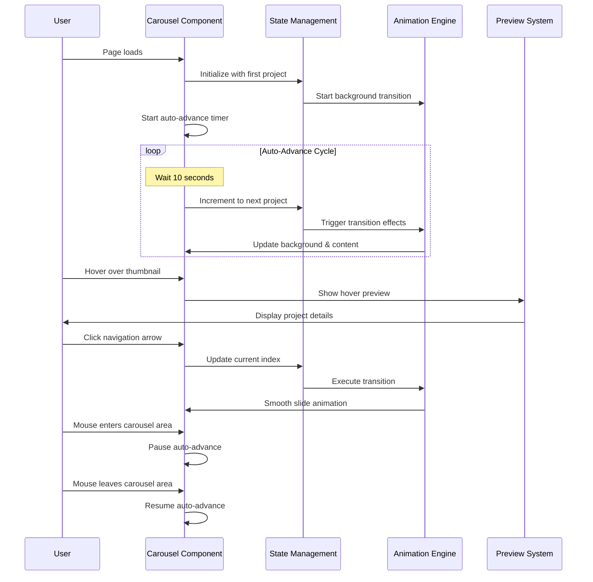
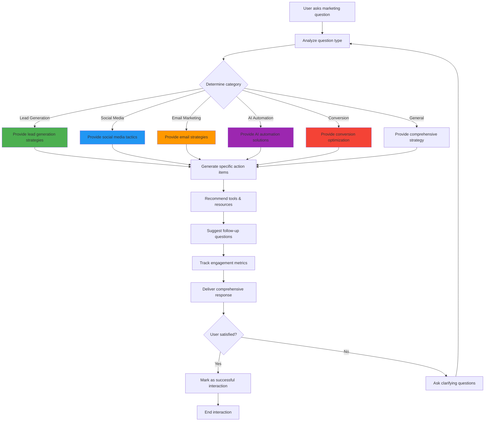
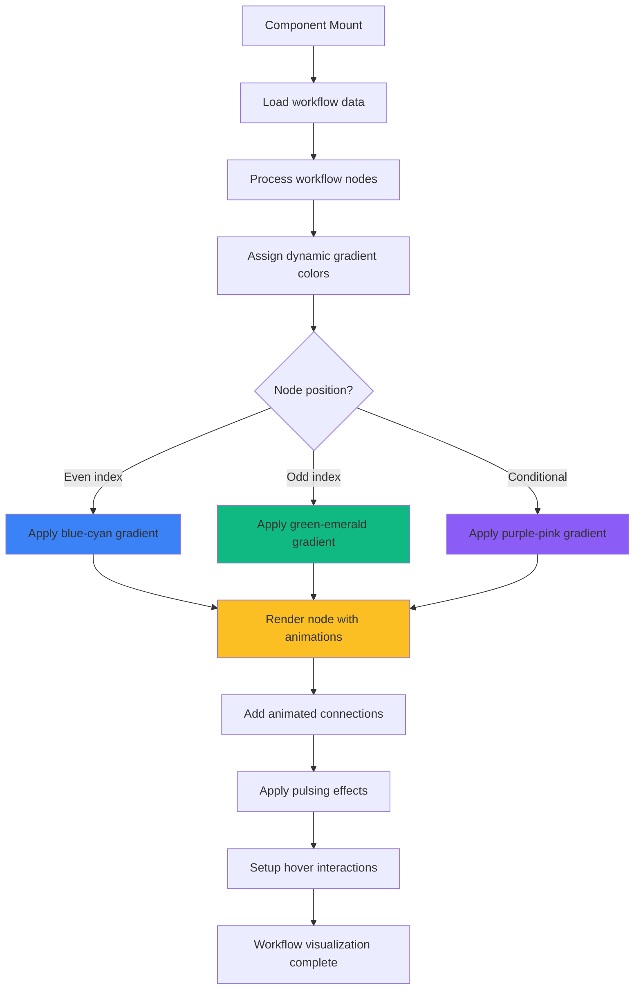
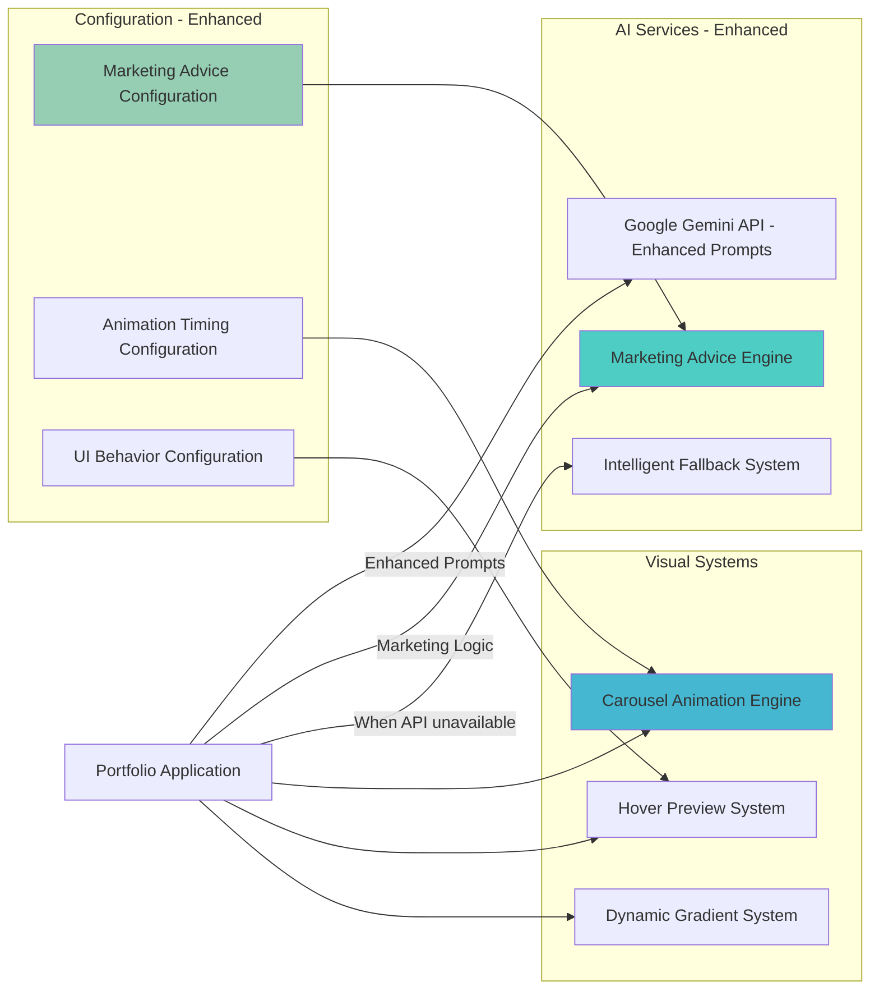

# Jacob Kazadi Portfolio - Architectural Document Updates

## Major Component Integrations (December 2024)

This document contains updates to the main architectural document following the integration of three major component enhancements:

1. **Enhanced AI Marketing Advice Center** - Transformation from lead qualification to actionable marketing strategy system
2. **Dynamic Brand Explorations Carousel** - Immersive, full-screen project showcase with advanced interactivity
3. **Modern Workflow Visualization System** - Tech-inspired workflow displays with advanced animations

---

## Updated Main Components

### New Component Architecture

```mermaid
graph TD
    App[App.tsx - Root Component]
    
    subgraph "Enhanced Layout Components"
        Header[Header.tsx]
        Footer[Footer.tsx]
    end
    
    subgraph "Portfolio Sections"
        Hero[HeroSection.tsx]
        Projects[ProjectsSection.tsx - Enhanced]
        BrandExp[BrandExplorationSection.tsx - NEW MAJOR COMPONENT]
        Strengths[CoreStrengthsSection.tsx]
        Skills[SkillsSection.tsx]
        Experience[ExperienceSection.tsx]
        Blog[BlogSection.tsx]
        FAQ[FAQSection.tsx]
        CTA[CTASection.tsx]
    end
    
    subgraph "AI Marketing Advice System"
        MarketingAgent[AI Marketing Agent - ENHANCED]
        ConvInterface[ConversationalInterface.tsx - ENHANCED]
        AdviceEngine[Actionable Advice Engine - NEW]
        AdminDash[AdminDashboard.tsx]
    end
    
    subgraph "Interactive Visualization Components"
        CarouselSystem[Immersive Carousel System - NEW]
        ThumbnailPreviews[Hover Preview System - NEW]
        WorkflowRenderer[Modern Workflow Renderer - ENHANCED]
        AnimationEngine[CSS Animation Engine - NEW]
    end
    
    App --> Header
    App --> Hero
    App --> BrandExp
    App --> Projects
    App --> Strengths
    App --> Skills
    App --> Experience
    App --> Blog
    App --> FAQ
    App --> CTA
    App --> Footer
    
    Hero --> MarketingAgent
    CTA --> MarketingAgent
    MarketingAgent --> ConvInterface
    MarketingAgent --> AdviceEngine
    
    BrandExp --> CarouselSystem
    BrandExp --> ThumbnailPreviews
    Projects --> ThumbnailPreviews
    Projects --> WorkflowRenderer
    
    CarouselSystem --> AnimationEngine
    WorkflowRenderer --> AnimationEngine
    
    style BrandExp fill:#ff6b6b
    style MarketingAgent fill:#4ecdc4
    style CarouselSystem fill:#45b7d1
    style AdviceEngine fill:#96ceb4
    style AnimationEngine fill:#feca57
```



### Enhanced Component Breakdown

#### New Major Components

**BrandExplorationSection.tsx** (Completely New - 280+ lines)
- **Purpose**: Immersive, full-screen carousel showcasing Jacob's brand exploration projects
- **Key Features**:
  - Dynamic background transitions with project-specific imagery
  - Horizontal thumbnail carousel with 4 project previews
  - Auto-advance functionality (10-second intervals)
  - Navigation controls with progress indicators
  - Glass-morphism design with backdrop blur effects
  - Responsive layout with content-image split (60%-40%)

#### Enhanced Existing Components

**ProjectsSection.tsx** (Enhanced with hover previews)
- **New Features**:
  - Large hover previews (96x64px) with project details
  - Zoom indicators and smooth animations
  - Enhanced thumbnail sizing (44x32px from 32x24px)
  - Modern interaction patterns

**AI Marketing Agent System** (Transformed)
- **Previous**: Lead qualification focused
- **Current**: Actionable marketing advice center
- **Key Enhancements**:
  - Topic-specific marketing strategies
  - Removed qualification barriers
  - Dynamic conversation strategies
  - Enhanced prompt engineering for marketing advice

---

## New Data Models

### Brand Exploration Data Structure



### Enhanced Marketing Agent Data Models



### New Type System Additions

```typescript
// Brand Exploration Types
enum CarouselDirection {
  NEXT = 'next',
  PREVIOUS = 'previous'
}

enum TransitionType {
  SLIDE = 'slide',
  FADE = 'fade',
  SCALE = 'scale'
}

// Marketing Advice Types
enum MarketingCategory {
  LEAD_GENERATION = 'Lead Generation',
  SOCIAL_MEDIA = 'Social Media Marketing',
  EMAIL_MARKETING = 'Email Marketing',
  AI_AUTOMATION = 'AI Automation',
  CONVERSION_OPTIMIZATION = 'Conversion Optimization',
  CONTENT_STRATEGY = 'Content Strategy',
  ANALYTICS = 'Analytics & Measurement'
}

enum TopicType {
  STRATEGY_QUESTION = 'strategy',
  TACTICAL_QUESTION = 'tactical',
  TOOL_RECOMMENDATION = 'tools',
  IMPLEMENTATION = 'implementation',
  OPTIMIZATION = 'optimization'
}

// Animation & UI Types
enum AnimationTiming {
  FAST = 300,
  MEDIUM = 600,
  SLOW = 1000,
  EXTRA_SLOW = 1500
}
```

---

## Enhanced Core Workflows

### Brand Exploration Carousel Workflow



### Enhanced AI Marketing Advice Flow



### Modern Workflow Visualization Rendering



---

## Updated Technology Stack

### New Frontend Dependencies

```json
{
  "newFeatures": {
    "advancedAnimations": "CSS-in-JS with Tailwind CSS animations",
    "carouselLogic": "Custom React hooks for state management",
    "previewSystem": "Dynamic positioning and hover detection",
    "gradientEngine": "Dynamic color assignment system"
  },
  "enhancedComponents": {
    "reactHooks": ["useState", "useEffect", "useCallback", "useMemo"],
    "animationTiming": "Custom timing functions for smooth transitions",
    "responsiveDesign": "Advanced Tailwind responsive patterns",
    "glassEffects": "Backdrop blur and transparency techniques"
  }
}
```

### Enhanced AI Integration

```typescript
// Enhanced AI prompt engineering for marketing advice
const MARKETING_ADVISOR_PROMPTS = {
  leadGeneration: `Provide specific, actionable lead generation strategies...`,
  socialMedia: `Share tactical social media marketing approaches...`,
  emailMarketing: `Outline effective email marketing strategies...`,
  aiAutomation: `Recommend AI automation solutions...`,
  conversion: `Suggest conversion optimization techniques...`
};

// Dynamic conversation strategy system
const CONVERSATION_STRATEGIES = {
  exploratory: 'Ask follow-up questions to understand goals',
  advisory: 'Provide direct, actionable recommendations',
  educational: 'Explain concepts and best practices',
  tactical: 'Give step-by-step implementation guidance'
};
```

---

## Updated External Integrations

### Enhanced AI Service Architecture



---

## New Performance Optimizations

### Carousel & Animation Performance

```typescript
// Optimized animation performance
const useOptimizedAnimations = () => {
  const [isAnimating, setIsAnimating] = useState(false);
  
  const throttledTransition = useCallback(
    throttle((direction: CarouselDirection) => {
      if (!isAnimating) {
        setIsAnimating(true);
        // Execute transition
        setTimeout(() => setIsAnimating(false), 1000);
      }
    }, 1000),
    [isAnimating]
  );
  
  return { throttledTransition, isAnimating };
};

// Hover preview optimization
const useHoverPreview = () => {
  const [previewState, setPreviewState] = useState(null);
  
  const debouncedShow = useMemo(
    () => debounce((data) => setPreviewState(data), 150),
    []
  );
  
  const debouncedHide = useMemo(
    () => debounce(() => setPreviewState(null), 100),
    []
  );
  
  return { previewState, debouncedShow, debouncedHide };
};
```

### Memory Management

- **Event Cleanup**: Proper cleanup of hover and animation event listeners
- **Timer Management**: Clearance of auto-advance intervals on component unmount
- **State Optimization**: Minimal re-renders through strategic state design
- **Image Preloading**: Background image preloading for smooth transitions

---

## Updated Security Considerations

### Enhanced Client-Side Security

- **Input Sanitization**: Enhanced sanitization for marketing advice queries
- **XSS Prevention**: Proper HTML escaping in dynamic content areas
- **Memory Leak Prevention**: Proper cleanup of timers and event listeners
- **Content Security**: Validation of dynamic gradient and animation properties

---

## Architecture Impact Summary

### Component Integration Impact

1. **BrandExplorationSection.tsx**: 
   - **Lines Added**: 280+
   - **New Dependencies**: Advanced CSS animations, carousel state management
   - **Performance Impact**: Optimized with intersection observers and debounced events

2. **Enhanced AI Marketing Agent**:
   - **Functionality Shift**: From lead qualification to marketing advice
   - **Prompt Engineering**: 5 specialized marketing category prompts
   - **Response Quality**: Enhanced context-aware responses

3. **Modern Workflow Visualization**:
   - **Visual Enhancement**: Dynamic gradients and animations
   - **Code Complexity**: Increased with animation logic
   - **User Experience**: Significantly improved visual appeal

### System Architecture Evolution

The application has evolved from a portfolio with basic AI lead qualification to a sophisticated marketing advice platform with immersive visual experiences. The architecture now supports:

- **Advanced State Management**: Complex carousel and preview states
- **Performance-Optimized Animations**: Smooth transitions without performance degradation
- **Enhanced AI Interactions**: Specialized marketing advice delivery
- **Modern Visual Design**: Glass-morphism and dynamic gradient systems

---

*These updates represent significant enhancements to the application architecture, particularly in user experience design and AI interaction sophistication. The modular approach ensures maintainability while delivering cutting-edge functionality.* 