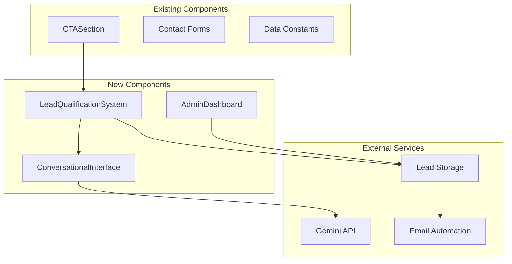

# Product Requirements Document: AI-Powered Lead Qualification System

## Feature Name
**AI-Powered Lead Qualification System with Intelligent Routing**

## Problem Statement

### Current State Pain Points
Jacob Kazadi Kayembe's portfolio site effectively showcases AI expertise and marketing automation capabilities, but currently lacks intelligent lead capture and qualification mechanisms. The existing contact flow presents several challenges:

1. **Unqualified Lead Overflow**: All contact form submissions are treated equally, regardless of project scope, budget, or urgency
2. **Manual Screening Overhead**: Jacob must manually review and categorize each inquiry, consuming valuable time that could be spent on high-value client work
3. **Missed Opportunity Identification**: High-potential leads may not be prioritized quickly enough, potentially losing business to competitors
4. **Generic Response Experience**: All inquiries receive the same initial response, missing opportunities for personalized engagement
5. **No Lead Intelligence**: Lack of data-driven insights about visitor intent, company size, or project complexity

### Business Impact
- **Time Inefficiency**: 3-5 hours weekly spent manually qualifying and responding to leads
- **Revenue Leakage**: Estimated 15-20% of high-value opportunities may be delayed or lost due to slow response times
- **Poor User Experience**: Generic contact forms don't reflect the sophisticated AI capabilities Jacob offers to clients
- **Missed Demonstration**: The contact process doesn't showcase Jacob's AI integration expertise

### Target Solution
Implement an AI-powered lead qualification system that automatically assesses, categorizes, and routes inquiries while providing personalized experiences that demonstrate Jacob's AI capabilities to potential clients.

## User Stories

### High-Priority User Stories

**As a potential client with a complex AI integration project,**
- I want to describe my project needs in natural language
- So that I can receive tailored information and be connected with the right expertise level

**As a startup founder seeking AI consultation,**
- I want to indicate my timeline and budget range
- So that I can receive appropriate service recommendations and priority handling

**As Jacob (the service provider),**
- I want leads automatically categorized by value and urgency
- So that I can prioritize my responses and focus on high-impact opportunities

**As a marketing manager exploring AI automation,**
- I want to see relevant case studies based on my industry and needs
- So that I can better understand how Jacob's services apply to my situation

### Medium-Priority User Stories

**As a repeat visitor considering engagement,**
- I want the system to remember my previous interactions
- So that I don't have to re-explain my context and needs

**As Jacob,**
- I want automated follow-up sequences for different lead types
- So that I can maintain engagement without manual intervention

**As a potential client,**
- I want to schedule a consultation directly through the qualification process
- So that I can move quickly from interest to action

### Low-Priority User Stories

**As Jacob,**
- I want analytics on lead qualification patterns
- So that I can optimize my service offerings and marketing approach

**As a potential client,**
- I want to receive educational content relevant to my specific AI implementation challenges
- So that I can better prepare for our potential collaboration

## Functional Requirements

### Core Qualification Engine
- **FR-001**: Implement conversational AI interface using Gemini API for natural language lead qualification
- **FR-002**: Automatically extract and classify key information:
  - Project type and complexity
  - Timeline urgency (immediate, 1-3 months, 3-6 months, future planning)
  - Budget range indicators
  - Company size and industry
  - Previous AI implementation experience
- **FR-003**: Score leads using weighted algorithm considering project value, timeline, and fit with Jacob's expertise
- **FR-004**: Route qualified leads to appropriate response templates and priority queues

### Intelligent Response System
- **FR-005**: Generate personalized initial responses based on qualification data
- **FR-006**: Automatically include relevant case studies and portfolio pieces based on lead characteristics
- **FR-007**: Provide dynamic next-step recommendations (consultation scheduling, resource sharing, proposal request)
- **FR-008**: Trigger appropriate email automation sequences based on lead category

### Integration Requirements
- **FR-009**: Seamlessly integrate with existing CTASection and contact flow
- **FR-010**: Maintain design consistency with current Tailwind CSS styling and component architecture
- **FR-011**: Store qualification data in structured format for CRM integration
- **FR-012**: Connect with existing email systems for automated follow-up

### User Experience Features
- **FR-013**: Progressive disclosure interface - reveal qualification questions naturally through conversation
- **FR-014**: Real-time typing indicators and response processing feedback
- **FR-015**: Mobile-responsive qualification interface
- **FR-016**: Option to save progress and return to complete qualification later

### Administrative Features
- **FR-017**: Dashboard for Jacob to review, override AI classifications, and manage lead pipeline
- **FR-018**: Customizable qualification criteria and scoring weights
- **FR-019**: Export qualified leads to CSV or integrate with CRM systems
- **FR-020**: Performance analytics for qualification accuracy and conversion rates

## Non-Functional Requirements

### Performance Requirements
- **NFR-001**: Qualification conversation response time < 2 seconds for 95% of interactions
- **NFR-002**: System uptime of 99.5% during business hours
- **NFR-003**: Handle up to 100 concurrent qualification sessions
- **NFR-004**: Load qualification interface in < 1.5 seconds on 3G connection

### Security & Privacy Requirements
- **NFR-005**: Encrypt all lead data in transit and at rest
- **NFR-006**: Implement GDPR-compliant data handling and deletion capabilities
- **NFR-007**: Secure API key management for Gemini API integration
- **NFR-008**: Rate limiting to prevent abuse (max 10 qualification attempts per IP per hour)

### Reliability Requirements
- **NFR-009**: Graceful degradation to standard contact form if AI service is unavailable
- **NFR-010**: Automatic retry logic for failed API calls
- **NFR-011**: Data backup and recovery procedures for lead information

### Usability Requirements
- **NFR-012**: Qualification completion rate > 70% for users who start the process
- **NFR-013**: Average qualification time < 5 minutes
- **NFR-014**: Support for screen readers and accessibility standards (WCAG 2.1 AA)

### Scalability Requirements
- **NFR-015**: Architecture supports scaling to 1000+ monthly qualified leads
- **NFR-016**: Modular design allows adding new qualification criteria without system redesign

## Technical Architecture

### Integration with Existing System
Based on the current React/TypeScript/Vite architecture:



### New Data Models Required
```typescript
interface LeadQualification {
  id: string;
  timestamp: Date;
  visitorId: string;
  conversationHistory: ConversationMessage[];
  extractedData: {
    projectType: ProjectType;
    timeline: TimelineUrgency;
    budgetRange: BudgetRange;
    companySize: CompanySize;
    industry: string;
    aiExperience: AIExperienceLevel;
  };
  qualificationScore: number;
  category: LeadCategory;
  status: LeadStatus;
  assignedResponse: ResponseTemplate;
}
```

## Out of Scope (for MVP)

### Features Excluded from Initial Release
- **Advanced CRM Integration**: Direct integration with Salesforce, HubSpot will be post-MVP
- **Multi-language Support**: Initially English-only qualification
- **Video/Voice Qualification**: Text-based conversation only for MVP
- **Advanced Analytics Dashboard**: Basic metrics only, comprehensive analytics in v2
- **A/B Testing Framework**: Single qualification flow for MVP
- **Calendar Integration**: Manual scheduling initially, automated booking in future release
- **Lead Scoring ML Model**: Rule-based scoring for MVP, machine learning optimization later
- **White-label Capabilities**: Custom branding for other consultants not included
- **API for Third-party Integrations**: Internal use only for MVP

### Technical Limitations for MVP
- **Real-time Collaboration**: No multiple admin users managing leads simultaneously
- **Advanced Reporting**: Basic export functionality only
- **Mobile App**: Web-responsive only, no native mobile application
- **Offline Capabilities**: Requires internet connection for qualification process

## Success Metrics

### Primary Success Metrics (90-day measurement period)

#### Lead Quality Improvement
- **Target**: 40% increase in qualified lead ratio (qualified leads / total inquiries)
- **Baseline**: Current manual qualification identifies ~60% of inquiries as qualified
- **Success Target**: 84% of AI-qualified leads should convert to initial consultation

#### Response Time Optimization
- **Target**: 85% reduction in initial response time
- **Baseline**: Average 4-8 hour manual response time
- **Success Target**: < 60 seconds for AI-generated initial responses

#### Conversion Rate Enhancement
- **Target**: 25% increase in consultation-to-proposal conversion rate
- **Baseline**: Current consultation conversion rate (to be established)
- **Success Target**: Qualified leads show 25% higher conversion than historical average

### Secondary Success Metrics

#### User Experience Metrics
- **Qualification Completion Rate**: > 70% of users who start qualification process complete it
- **User Satisfaction Score**: > 4.0/5.0 rating on post-qualification survey
- **Time to Qualification**: Average qualification time < 5 minutes

#### Operational Efficiency Metrics
- **Time Savings**: 3-5 hours weekly time savings for Jacob in lead management
- **Lead Processing Speed**: 95% of leads categorized within 2 minutes of submission
- **System Reliability**: < 2% false positive rate in lead qualification

#### Business Impact Metrics
- **Pipeline Value**: 30% increase in qualified pipeline value within 90 days
- **Client Acquisition Cost**: 20% reduction in CAC for leads through qualification system
- **Revenue Attribution**: Track revenue from AI-qualified leads vs. traditional contact forms

### Long-term Success Indicators (6-12 months)
- **Market Differentiation**: Position as one of few AI consultants using AI for their own lead process
- **Referral Generation**: Qualified clients should generate 1.5x more referrals than traditional leads
- **Content Intelligence**: Use qualification data to inform content strategy and case study development

### Measurement and Monitoring Plan
- **Weekly**: Lead volume, qualification completion rates, system performance
- **Monthly**: Conversion rates, revenue attribution, user satisfaction scores
- **Quarterly**: ROI analysis, competitive differentiation assessment, feature usage analytics

## Implementation Phases

### Phase 1: Core Qualification Engine (Weeks 1-4)
- Basic conversational interface
- Gemini API integration
- Lead scoring algorithm
- Data storage implementation

### Phase 2: User Experience Polish (Weeks 5-6)
- UI/UX refinement
- Mobile responsiveness
- Accessibility compliance
- Error handling and edge cases

### Phase 3: Integration and Testing (Weeks 7-8)
- Integration with existing site architecture
- Automated response system
- Dashboard development
- Comprehensive testing and QA

### Phase 4: Launch and Optimization (Weeks 9-12)
- Soft launch with monitoring
- Performance optimization
- User feedback incorporation
- Full production deployment

This AI-Powered Lead Qualification System will serve as both a practical business tool and a demonstration of Jacob's AI integration expertise, creating a competitive advantage while improving operational efficiency and lead quality. 